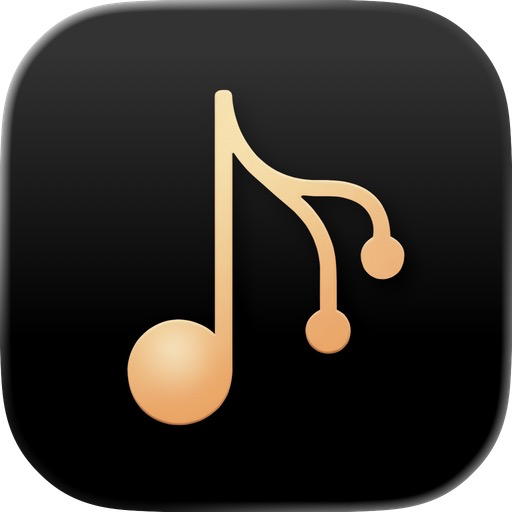

<table><tr><td>

# Melomaniac

[](https://github.com/Angle-Brackets/Melomaniac/actions/workflows/ci.yml)


A local-first, cross-platform music player with **git-style playlist versioning**. Every track, artwork, and playlist snapshot is a BLAKE3-hashed blob. Playlists are repositories. Branches are sub-playlists. Forks are forks. Devices sync over LAN the same way developers sync code — by diffing commits and merging changes.

**Platforms:** macOS · Linux · Windows · iOS (real device + simulator)

</td><td>



</td></tr></table>

---

## Features

### Playback
- Desktop audio via **rodio** (MP3, FLAC, OGG, WAV, M4A/AAC, ALAC, Opus)
- iOS audio via **AVFoundation** — background audio session, lock screen controls, Now Playing widget
- **Shuffle modes**: Random (Fisher-Yates) and Smart (artist-spread weighted, avoids consecutive same-artist)
- **AB loop** with per-track A/B timestamps persisted across restarts
- Queue management with drag-to-reorder
- Discord Rich Presence (desktop)

### Library
- **Content-addressed storage** — files stored by BLAKE3 hash; zero duplication
- **yt-dlp ingestion** — paste any URL, audio downloads to CAS with metadata; background queue with progress ring
- **Metadata editor** — read/write MP3/FLAC/OGG tags via `lofty`; bulk edit; artwork library
- Listening statistics — play counts, skip counts, per-track history

### Playlist Versioning
- Every change creates a **commit** (author, timestamp, parent hash)
- **Branches** — multiple named branches per playlist; create, switch, delete inline
- **Fork** — branch a playlist into a new independent playlist at any commit
- **3-way DAG merge** — fast-forward, auto-merge, or conflict resolution
- **Conflict UI** — amber badge + diff viewer shows exactly which tracks conflict and lets you pick a resolution
- **Commit graph** visualisation (desktop)

### LAN Sync
- **Zero-config discovery** via mDNS-SD (`_melomaniac._tcp.local.`)
- **QR pairing** — scan from desktop to iOS, keys exchanged once, persisted to trust list
- **Ed25519 signed requests** — all sync HTTP calls carry a signed timestamp; replays rejected
- **Auto-sync** — silently fast-forwards branches when a peer comes online
- Transfers audio blobs and artwork blobs; per-track download progress ring
- Peer latency display, known device management

### Desktop UI
- Three-column layout: sidebar rail · main panel · right panel (queue / info)
- Playlist sidebar with folders, drag-to-reorder, pin-to-top, conflict badges
- Coverflow album carousel
- Frameless custom titlebar
- Theme system: Warm · Cool · Dark · Custom hue (oklch)
- Track list density: compact · normal · relaxed

### Mobile UI (iOS)
- Tab navigation: Library · Discover · Now Playing · Settings
- `PlaylistDetail` slide overlay with branch picker, fork, edit, merge sheets
- Swipe-to-delete with vertical-scroll cancel guard
- Pull-to-refresh, swipe-back gesture
- In-app browser (SFSafariViewController)

---

## Architecture

```
┌──────────────────────────────────────────────────────────────────────┐
│                        React 18 / TypeScript                         │
│                                                                      │
│   DesktopApp (3-column)          MobileApp (tab nav)                 │
│   ├─ Sidebar (rail + tree)       ├─ Library / PlaylistsList          │
│   ├─ LibraryView / EditorView    ├─ PlaylistDetail (slide overlay)   │
│   ├─ RightPanel / Queue          ├─ NowPlaying / Discover            │
│   └─ PlayerControls              └─ Settings                         │
│                                                                      │
│   Shared: DiffViewer · PairingModal · PeerPlaylistsModal · MusicCard │
│                                                                      │
│   Zustand Store                                                      │
│   ├─ librarySlice   tracks, artwork cache, library status            │
│   ├─ playbackSlice  currentTrack, isPlaying, volume, AB loop         │
│   ├─ playlistSlice  active playlist, branches, commit history        │
│   ├─ queueSlice     queue, shuffle (Random/Smart), advance           │
│   └─ syncSlice      livePeers, knownDevices, conflicts, progress     │
└──────────────┬───────────────────────────────┬───────────────────────┘
               │  invoke() / listen()          │
               │  @tauri-apps/api/core         │
┌──────────────▼───────────────────────────────▼───────────────────────┐
│                   Tauri 2 Command Layer  (src-tauri/src/)            │
│                                                                      │
│  audio.rs      audio_load · audio_play · audio_pause · audio_seek    │
│                audio_stop · audio_set_volume · audio_position        │
│  storage.rs    playlist_get_all · playlist_get_tracks · track_ingest │
│                track_get_artwork · library_remove_tracks · …         │
│  sync.rs       sync_get_peers · sync_with_peer · sync_playlist       │
│                sync_generate_qr_payload · sync_accept_qr_pairing …   │
│  editor.rs     editor_read_tags · editor_write_tags · …              │
│  stats.rs      get_system_stats · open_url_in_app                    │
│  downloader.rs download_enqueue · download_queue                     │
└──────────┬──────────────────────┬──────────────────┬─────────────────┘
           │                      │                  │
    ┌──────▼──────┐        ┌──────▼──────┐    ┌──────▼──────┐
    │ melomaniac  │        │ melomaniac  │    │ melomaniac  │
    │   -audio    │        │  -storage   │    │   -sync     │
    │             │        │             │    │             │
    │ AudioBridge │        │ CasStore    │    │ SyncBridge  │
    │ trait       │        │ (BLAKE3)    │    │ trait       │
    │             │        │             │    │             │
    │ Desktop:    │        │ Database    │    │ Desktop:    │
    │ DesktopBridge│       │ (SQLite/WAL)│    │ DesktopSync │
    │ rodio 0.22  │        │             │    │ Bridge      │
    │ MixerDevice │        │ Indexer     │    │ (mdns-sd)   │
    │ Sink        │        │ (startup    │    │             │
    │ + OS thread │        │  reconcile) │    │ iOS:        │
    │             │        │             │    │ IosSyncBridge│
    │ iOS:        │        │ merge.rs    │    │ (NWBrowser  │
    │ IosBridge   │        │ 3-way DAG   │    │  NWListener │
    │ Swift FFI ──┼──┐     │ merge engine│    │  Swift FFI) │
    └─────────────┘  │     └─────────────┘    └──────┬──────┘
                     │                               │
    ┌────────────────▼─────┐              ┌──────────▼────────────┐
    │  MelomaniacPlayer    │              │   MelomaniacSync      │
    │  (Swift static lib)  │              │   (Swift static lib)  │
    │                      │              │                       │
    │  AVAudioPlayer       │              │  NWBrowser (discover) │
    │  AVAudioSession      │              │  NWListener(advertise)│
    │  MPNowPlaying        │              │  @_cdecl FFI exports  │
    │  MPRemoteCommand     │              │                       │
    │  SFSafariViewController│            │  Axum HTTP server     │
    │  @_cdecl FFI exports │              │  (shared with desktop)│
    └──────────────────────┘              └───────────────────────┘
           │                                        │
    ┌──────▼────────────────────────────────────────▼──────┐
    │               OS / Hardware                          │
    │                                                      │
    │  Desktop: cpal audio device, mDNS socket, TCP/7700   │
    │  iOS:     AVFoundation, Network.framework, TCP/7700  │
    └──────────────────────────────────────────────────────┘
```

### Communication Bridges

| Direction | Mechanism | Used for |
|---|---|---|
| Frontend → Rust | `invoke()` from `@tauri-apps/api/core` | All commands |
| Rust → Frontend | `AppHandle::emit("event://name", payload)` | Audio events, sync progress |
| Rust → Swift (audio) | C FFI via `@_cdecl` exports in `MelomaniacPlayer.swift` | Play, pause, seek, volume, Now Playing |
| Rust → Swift (sync) | C FFI via `@_cdecl` exports in `MelomaniacSync.swift` | mDNS register/browse |
| Peer → Peer (sync) | Axum HTTP on port 7700, Ed25519-signed headers | Manifest, blob transfer, pairing |

### Crate Workspace (`src-tauri/crates/`)

| Crate | Purpose |
|---|---|
| `melomaniac-audio` | `AudioBridge` trait + platform implementations (rodio desktop, AVFoundation iOS) |
| `melomaniac-storage` | SQLite database, BLAKE3 CAS blob store, playlist DAG, indexer |
| `melomaniac-sync` | mDNS-SD discovery, Axum HTTP sync server/client, 3-way merge engine |

### Storage Layout

| Platform | Path |
|---|---|
| Linux | `~/.local/share/com.melomaniac.app/` |
| macOS | `~/Library/Application Support/com.melomaniac.app/` |
| Windows | `%APPDATA%\com.melomaniac.app\` |
| iOS | App sandbox `Application Support/` |

Within the app data directory:
```
melomaniac.db          SQLite database
cas/
  <xx>/
    <remaining-62>     BLAKE3-hashed audio + artwork blobs
```

---

## Development

### Prerequisites

- [Rust](https://rustup.rs/) 1.87+
- [Node.js](https://nodejs.org/) 20+
- [Tauri CLI](https://tauri.app/): `cargo install tauri-cli`
- **iOS only**: Xcode 15+, Apple Developer account, `npm install -g ios-deploy`

### Commands

```bash
# Desktop dev (Vite HMR + Tauri)
npm run tauri dev

# Frontend only — hot-reload at http://localhost:1420 (no Rust needed)
npm run dev

# Desktop UI in a mobile-sized window (no Rust needed, for mobile UI work)
npm run dev:mobile

# iOS simulator
npm run ios:sim

# iOS on a real device
npm run ios:dev

# Type-check + production build
npm run build

# Run tests (Vitest)
npm test

# Run Rust tests
cd src-tauri && cargo test --workspace
```

### Project Structure

```
src/
  App.tsx                    Platform router (VITE_PLATFORM → DesktopApp | MobileApp)
  desktop/
    DesktopApp.tsx           Root desktop component — all state lives here
    components/              Sidebar, LibraryView, EditorView, PlayerControls, …
    icons.tsx                Shared icon library (react-icons/fi + custom SVGs)
    types.ts                 Desktop-specific TypeScript types
  mobile/
    MobileApp.tsx            Root mobile component
    components/              Library, PlaylistDetail, NowPlaying, Settings, …
    icons.tsx                Mobile icon set (custom SVGs, stroke-based)
  components/                Shared: DiffViewer, PairingModal, PeerPlaylistsModal
  store/
    index.ts                 Zustand store — assembles all slices
    librarySlice.ts
    playbackSlice.ts
    playlistSlice.ts
    queueSlice.ts
    syncSlice.ts
    types.ts                 Shared store types
  shared/
    themes.ts                Named themes + oklch custom hue system

src-tauri/
  src/                       Tauri command handlers (audio, storage, sync, editor, …)
  crates/
    audio/                   melomaniac-audio crate
      ios/                   MelomaniacPlayer Swift package (AVFoundation FFI)
    storage/                 melomaniac-storage crate
    sync/                    melomaniac-sync crate
      ios/                   MelomaniacSync Swift package (NWBrowser/NWListener FFI)
  capabilities/
    default.json             Desktop capabilities
    mobile.json              iOS capabilities
  tauri.conf.json
```

---

## Sync Protocol

Melomaniac's LAN sync is a pull-based HTTP protocol over port 7700:

1. **Discovery**: mDNS-SD announces `_melomaniac._tcp.local.` with the device's hostname and public key fingerprint.
2. **Pairing**: First contact uses QR code exchange. Desktop generates a QR payload containing its public key and address; iOS scans it, sends its own key back to `/pair`. Both sides persist the trust list.
3. **Auth**: Every request carries a header with an Ed25519 signature over `device_id:timestamp_ms`. Replays outside a 30-second window are rejected.
4. **Auto-sync**: `triggerAutoSync` polls peers every few seconds, fetches `/manifest` (all branch HEAD hashes), diffs against `lastSeenHeads`, and calls `sync_playlist` for each changed branch.
5. **sync_playlist**: Pulls the peer's commit chain (`/commits/:id/:branch`), downloads missing blobs (`/blob/:hash`), runs 3-way merge, writes result. Fast-forwards or auto-merges silently; true conflicts go to `pending_merges` and surface in the UI.

---

## License

GPLv3 — see [LICENSE](LICENSE).
